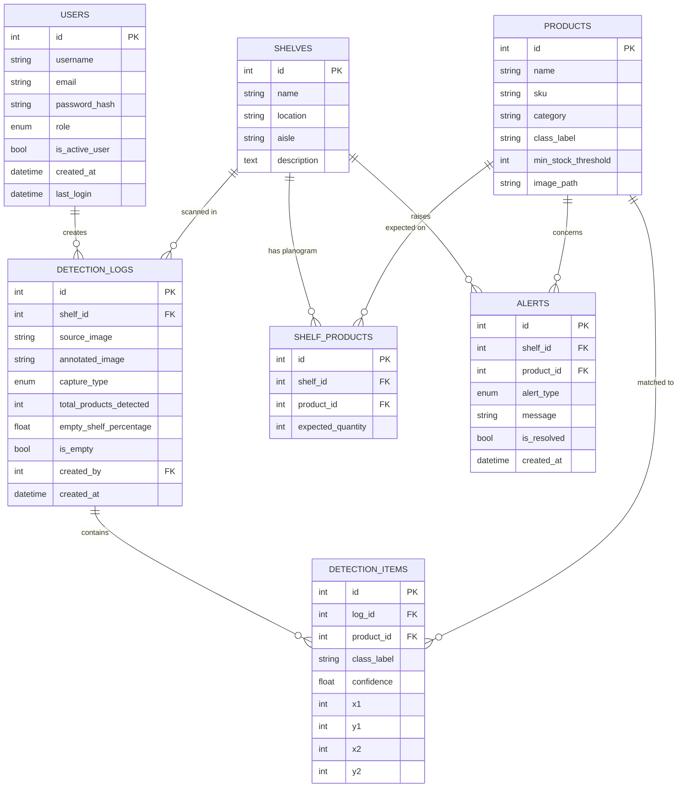

# Entity-Relationship Diagram

## Relationship notes

- A **Shelf** has a planogram: a set of `SHELF_PRODUCTS` rows defining which
  products are expected on it and in what quantity.
- Every scan (image upload or webcam capture) creates one `DETECTION_LOGS`
  row and one `DETECTION_ITEMS` row per bounding box YOLOv8 finds.
- `DETECTION_ITEMS.product_id` is nullable because YOLOv8 may detect a class
  label that hasn't been registered as a `Product` yet.
- `ALERTS` are generated automatically by the detection pipeline
  (`app/utils/shelf_analysis.py`) for three cases: empty shelf, low stock,
  and misplaced product (a known product detected on a shelf where it isn't
  part of the planogram).
