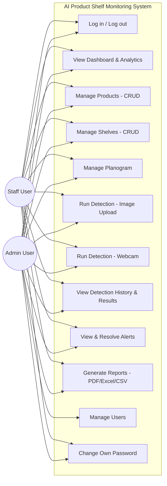

# Use Case Diagram

```mermaid
flowchart LR
    Staff((Staff User))
    Admin((Admin User))

    subgraph "AI Product Shelf Monitoring System"
        UC1[Log in / Log out]
        UC2[View Dashboard & Analytics]
        UC3[Manage Products - CRUD]
        UC4[Manage Shelves - CRUD]
        UC5[Manage Planogram]
        UC6[Run Detection - Image Upload]
        UC7[Run Detection - Webcam]
        UC8[View Detection History & Results]
        UC9[View & Resolve Alerts]
        UC10[Generate Reports - PDF/Excel/CSV]
        UC11[Manage Users]
        UC12[Change Own Password]
    end

    Staff --> UC1
    Staff --> UC2
    Staff --> UC3
    Staff --> UC4
    Staff --> UC5
    Staff --> UC6
    Staff --> UC7
    Staff --> UC8
    Staff --> UC9
    Staff --> UC10
    Staff --> UC12

    Admin --> UC1
    Admin --> UC2
    Admin --> UC3
    Admin --> UC4
    Admin --> UC5
    Admin --> UC6
    Admin --> UC7
    Admin --> UC8
    Admin --> UC9
    Admin --> UC10
    Admin --> UC11
    Admin --> UC12
```

Only **Admin** users can access User Management (`/users`); all other
features are shared between the `staff` and `admin` roles.
